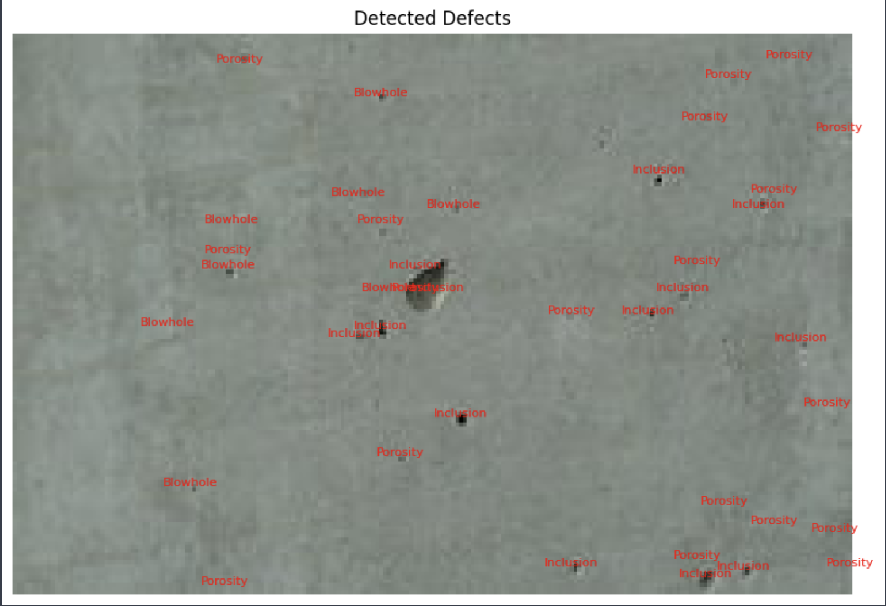
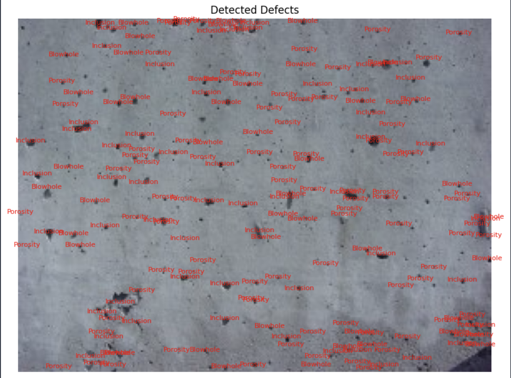

# EvaDB_Vision_EXT
Some computer vision extensions to EvaDB and an example of using them instead of training an ML model to solve it.
## Instructions:
  1. Add `blob_detector.py`, `grayscale.py`, `high_pass.py`, `moment.py`, and `threshold.py` to the `.../evadb/functions/ndarray` folder of your evadb library location.
  2. The `Concrete_detector.py` will process every image in [Image](https://github.com/mohammadhosseinipour/EvaDB_Vision_EXT/tree/main/Images) folder with `.jpeg` format!
  3. That's it!

### Setup:
  Ensure that the local Python version is >= 3.11.5. To install the required libraries, run the following command on your terminal in the repository's root path(It is recommended to use a virtual environment!):
  
  ```bat
  pip install -r requirements.txt
  ```
  
## How to run the example?
  1. Run `Concrete_detector.py` in your terminal(make sure Images folder is in the same place!).
  ```bat
  python3 Concrete_detector.py
  ```
  2. Enter the path where the evadb root library is there.


### Result Examples:

  
